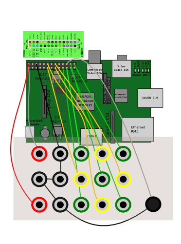
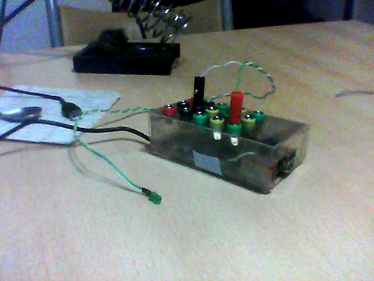
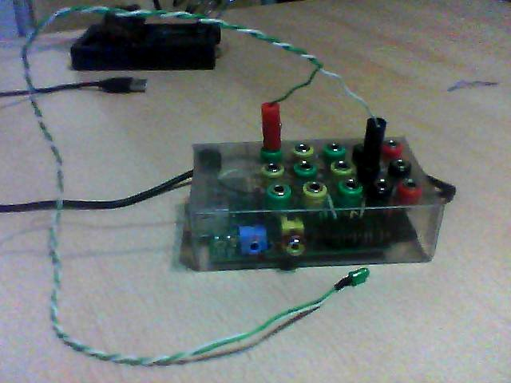
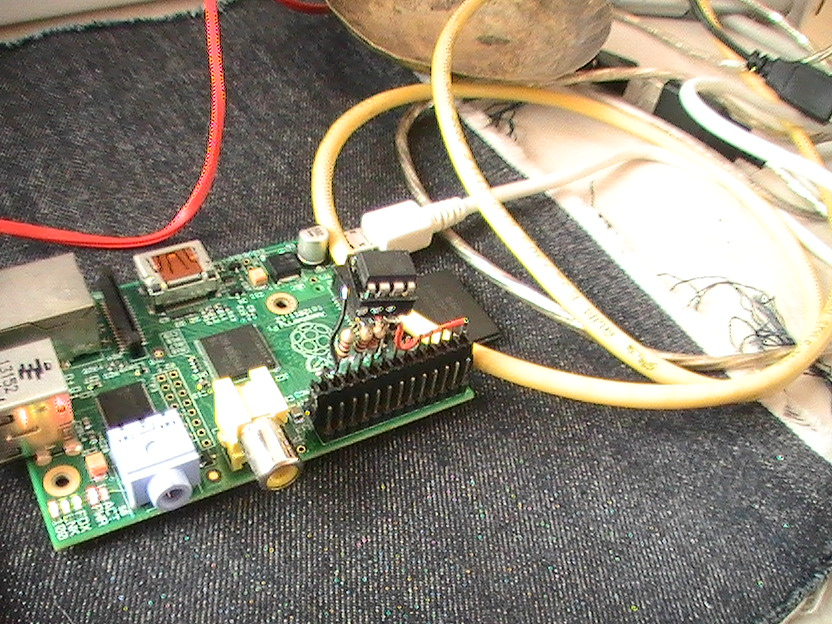
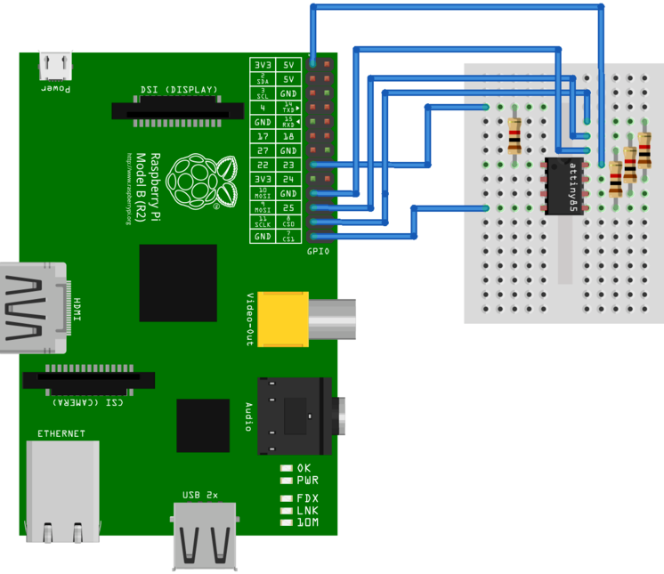

# Raspberry PI

Le manguie a [m4tu5](https://github.com/m4tu5) que cuando fuera a europa me la comprara.

## RaspBMC

Lo descargue del [sitio oficial](http://www.raspberrypi.org/downloads). 
Fue muy simple de instalar, solo hay que volcarlo a la microSD y al iniciar se realiza todo el resto, preferiblemente tiene que estar conectada a internet.
Funciona muy bien.

_**Nota:** Arora browser se instalo como parte de una actualización pero no funciona :(_

## Raspbian

Descargue la imagen y la deszipie luego lo bloque a la microSD. Salio andando.

### Pendientes

* Generar un escritorio con [remina](http://remmina.sourceforge.net/) para tener un escritorio de mas de 640x480 seguramente 6 veces mas grande :P

## GPIO

Compile la herramientas para manejar en [bash los puertos GPIO](http://elinux.org/Rpi_Low-level_peripherals#Bash_shell_script.2C_using_sysafs.2C_part_of_the_raspbian_operating_system).
Como la experiencia fue muy simple solo tuve que usar ... pensé en ponerle una interfaz más amigable a algunos puestos del GPIO. 
Copiándome de la experiencia del [Gamepad universal](http://wiki.hackcoop.com.ar/Gamepad_universal) de [li-kun](https://github.com/li-kun) use fichas banana y un envase de plástico duro hecho cortado a mano.
Y los conectores de led de unas PCs viejas que sirvieron para conectar el GPIO a las fichas banana.

> 0, 1, 4, 7, 8, 9, 10, 11, 14, 15, 17, 18, 21, 22, 23, 24, 25 deberia usar solo estos puertos

### El control del GPIO desde la terminal

~~~
cd ~
git clone git://git.drogon.net/wiringPi
cd wiringPi
./build 
~~~

Aunque la salida de sonido no es análoga puede generar sonidos usando una modificación de `blink.c` para generar un pseudo-pwm.

## Pantalla

Lo conecte por RCA y anduvo directamente

### Android

Como tenia un android roto de mi hermana lo pensaba usar de pantalla y placa de red, usando este tutorial: http://blog.mohammedlakkadshaw.com/Android_as_display.html

Conecte el android al raspeberry y puse el android en metodo anclaje (tethering), luego instale `x11vnc` y `xvfb` en la raspberry y en el android `androidvnc`.
Mi idea es tener 2 pantallas una por red y otra fisica por HDMI/RCA

~~~
sudo ifconfig usb0 192.168.42.10
Xvfb :0 -screen 0 640x480x16 -shmem
x11vnc -display : 0
~~~

### Pendientes

* Pull-up en los puertos
* ~~Probarlo bien~~
 * algunos puertos no andan, por que son internos del raspberry(24,25)
 * Ejemplos de programación
* Compilar [Bluetooth de Guerrilla](https://github.com/b4zz4/BluetoothDeGuerrilla) para Raspberry

## RaspISP

Este tutorial esta armado para Raspberry (el debian para raspberry)

Lo primero que hay que hacer es configurar el ISP de RaspberryPI con el comando `raspi-config`.
El ISP es un modo de comunicar dispositivos con otros, se usa principalmente para grabar datos en un microcontrolador.

~~~
cd  ~
sudo apt-get install bison automake autoconf flex git gcc gcc-avr binutils-avr avr-libc
git clone https://github.com/kcuzner/avrdude 
cd avrdude/avrdude
./bootstrap && ./configure && sudo make install
~~~

### Conector

> Ahora tenemos que conectar nuestro ATtiny85 a la raspberryPI. Las resistencias son todas de Ko Ohm.

### Conectar al ATtiny85

Vamos a necesitar el control de GPIO que se explico anteriormente

~~~
sudo gpio -g mode 22 out
sudo gpio -g write 22 0
sudo avrdude -p t85 -P /dev/spidev0.0 -c linuxspi -b 10000
sudo gpio -g write 22 1
~~~

### Instalar el firmware

~~~
wget https://github.com/b4zz4/RaspberryPI/raw/master/micronucleus-1.06-upgrade.hex
~~~

Descargamos el firmware, es un programa que hace que el ATtiny85 se pueda acceder desde el USB y programarlo como un arduino.

~~~
sudo gpio -g mode 22 out
sudo gpio -g write 22 0
sudo avrdude -P /dev/spidev0.0 -c linuxspi -b 10000 -p t85 -U flash:w:micronucleus-1.06-upgrade.hex -U lfuse:w:0xe1:m -U hfuse:w:0x5d:m -U efuse:w:0xfe:m
sudo gpio -g write 22 1
~~~

Grabamos el firmware, en el microcontrolador.

* El Firmware orignal se puede bajar de https://github.com/micronucleus/micronucleus
* Este tutorial esta basado en http://www.paperduino.eu/doku.php?id=burning_bootloader

### Circuito para conectar por USB
 

* Diodo 1N4148 
* 2 Diodos zener 3V6
* Resistencia 1k5 - 1500 Ohms 1/4W 
* 2 Resistencia 68 Ohm 1/4W
* Capacitor Ceramico 100nF 
* Capacitor Electrolitico 10uF/16V 

En mi experiencia de armar este circuito no logro comunicarse con la computadora.
Para que la computadora lo detecte necesitamos instalar las reglas de [Digispak](...) en [Arduino](...).

### Pendientes

Hacer que ande el arduino con este circuito.

~~~
void setup() {               
  // inicia los pins
  pinMode(0, OUTPUT);	// LED1
  pinMode(1, OUTPUT);	// LED2
}
void loop() {
  // prende el LED1 y apaga el LED2
  digitalWrite(0, HIGH);
  digitalWrite(1, LOW);
  delay(1000);	//espera 1 segundo
  // apaga el LED1 y prende el LED2
  digitalWrite(0, LOW);
  digitalWrite(1, HIGH);
  delay(1000);	// espera 1 segundo
}
~~~

## Material de terceros

* https://upload.wikimedia.org/wikipedia/commons/a/af/Raspberrypi_pcb_overview_v04.svg
