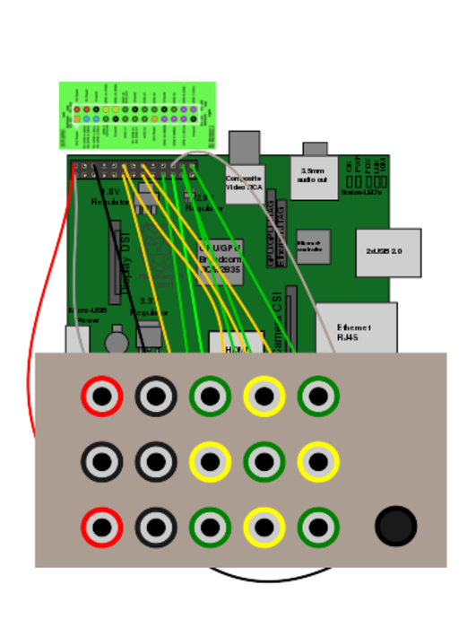
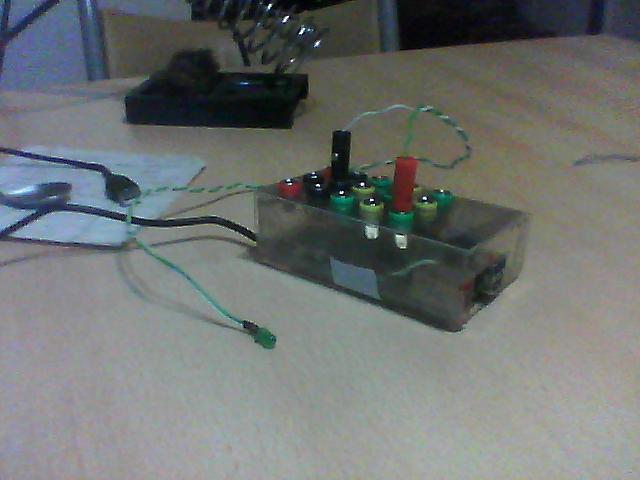
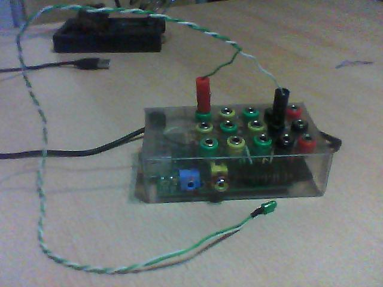
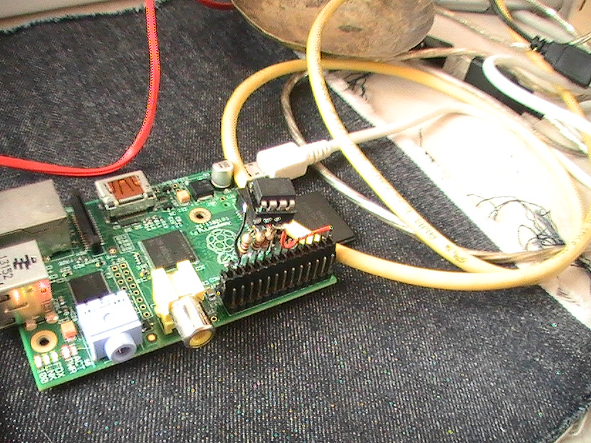
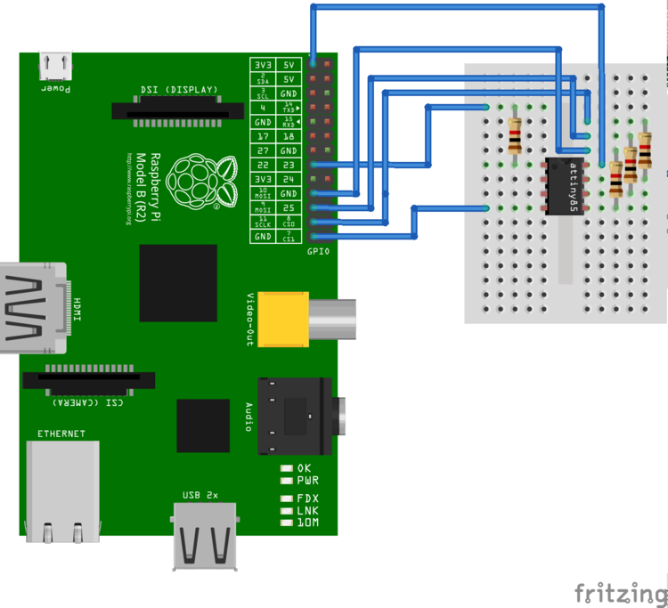
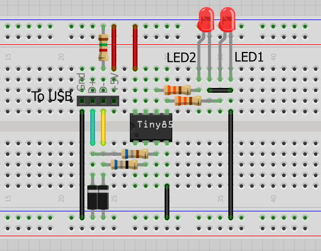

# Raspberry PI

Le manguie a [m4tu5](https://github.com/m4tu5) que cuando fuera a europa me la comprara.

## RaspBMC

Lo descargue del [sitio oficial](http://www.raspberrypi.org/downloads). 
Fue muy simple de instalar, solo hay que volcarlo a la microSD y al iniciar se realiza todo el resto, preferiblemente tiene que estar conectada a internet.
Funciona muy bien.

_**Nota:** Arora browser se instalo como parte de una actualización pero no funciona :(_

## GPIO

compile la herramientas para manejar en [bash los puertos GPIO](http://elinux.org/Rpi_Low-level_peripherals#Bash_shell_script.2C_using_sysafs.2C_part_of_the_raspbian_operating_system).
Como la experiencia fue muy simple solo tuve que usar ... pensé en ponerle una interfaz más amigable a algunos puestos del GPIO. 
Copiándome de la experiencia del [Gamepad universal](http://wiki.hackcoop.com.ar/Gamepad_universal) de [li-kun](https://github.com/li-kun) use fichas banana y un envase de plástico duro hecho cortado a mano.
Y los conectores de led de unas PCs viejas que sirvieron para conectar el GPIO a las fichas banana.

> 0, 1, 4, 7, 8, 9, 10, 11, 14, 15, 17, 18, 21, 22, 23, 24, 25 deberia usar solo estos puertos

Aunque la salida de sonido no es análoga puede generar sonidos usando una modificación de `blink.c` para generar un pseudo-pwm.

## Material de terceros

* https://upload.wikimedia.org/wikipedia/commons/a/af/Raspberrypi_pcb_overview_v04.svg

### Pendientes

* Pull-up en los puertos
* ~~Probarlo bien~~
 * algunos puertos no andan, por que son internos del raspberry(24,25)
* Ejemplos de programación

## RaspISP

Este tutorial esta armado para Raspberry (el debian para raspberry)

Lo primero que hay que hacer es configurar el ISP de RaspberryPI con el comando `raspi-config`.

~~~
cd  ~
sudo apt-get install bison automake autoconf flex git gcc gcc-avr binutils-avr avr-libc
git clone https://github.com/kcuzner/avrdude 
cd avrdude/avrdude
./bootstrap && ./configure && sudo make install
~~~

El control del gpio desde la terminal

~~~
cd ~
git clone git://git.drogon.net/wiringPi
cd wiringPi
./build 
~~~

### Conectar al ATtiny85

> Ahora tenemos que conectar nuestro ATtiny85 a la raspberryPI. Las resistencias son todas de 1000 Ohm.

~~~
sudo gpio -g mode 22 out
sudo gpio -g write 22 0
sudo avrdude -p t85 -P /dev/spidev0.0 -c linuxspi -b 10000
sudo gpio -g write 22 1
~~~

### Instalar el firmware

~~~
wget https://github.com/b4zz4/RaspberryPI/raw/master/micronucleus-1.06-upgrade.hex
sudo gpio -g mode 22 out
sudo gpio -g write 22 0
sudo avrdude -P /dev/spidev0.0 -c linuxspi -b 10000 -p t85 -U flash:w:micronucleus-1.06-upgrade.hex -U lfuse:w:0xe1:m -U hfuse:w:0x5d:m -U efuse:w:0xfe:m
sudo gpio -g write 22 1
~~~

El orignal se puede bajar de https://github.com/micronucleus/micronucleus

Este tutorial esta basado en http://www.paperduino.eu/doku.php?id=burning_bootloader

### Pendientes

> Este dibujo no es difinitivo

* Diodo 1N4148
* 2 Diodo zener 3.6v 1/2 W
* Resistencia 1k5 - 1500 ohms 1/4W 
* 2 Resistencia 68 ohms 1/4
* Capacitor Ceramico 100nF
* Capacitor Electrolitico 10uF/16V 

~~~
void setup() {               
  // inicia los pins
  pinMode(0, OUTPUT);	// LED1
  pinMode(1, OUTPUT);	// LED2
}
void loop() {
  // prende el LED1 y apaga el LED2
  digitalWrite(0, HIGH);
  digitalWrite(1, LOW);
  delay(1000);	//espera 1 segundo
  // apaga el LED1 y prende el LED2
  digitalWrite(0, LOW);
  digitalWrite(1, HIGH);
  delay(1000);	// espera 1 segundo
}
~~~

Mostrar como programar por USB

# RaspberryPI RepRap

## Printrun

~~~ 
sudo apt-get install -y python-pip git mercurial python-distribute wx-common  python-pmw python-imaging python python-tk idle python-psutil python-wxtools
sudo easy_install pip
sudo pip install pyserial
cd
git clone https://github.com/kliment/Printrun.git
wget http://fabmetheus.crsndoo.com/files/50_reprap_python_beanshell.zip
unzip 50_reprap_python_beanshell.zip
cd Printrun
python setup.py build
sudo python setup.py install
~~~

## Slic3r

~~~
sudo apt-get install -y git-core build-essential libgtk2.0-dev libwxgtk2.8-dev libwx-perl libmodule-build-perl libnet-dbus-perl cpanminus libextutils-cbuilder-perl gcc-4.7 g++-4.7 libwx-perl libperl-dev
sudo cpanm AAR/Boost-Geometry-Utils-0.06.tar.gz Math::Clipper Math::ConvexHull Math::ConvexHull::MonotoneChain Math::Geometry::Voronoi Math::PlanePath Moo IO::Scalar Class::XSAccessor Growl::GNTP XML::SAX::ExpatXS PAR::Packer
cd
git clone https://github.com/alexrj/Slic3r.git
cd Slic3r
git checkout 0.9.9
yes | sudo perl Build.PL
sudo ./Build install
~~~
