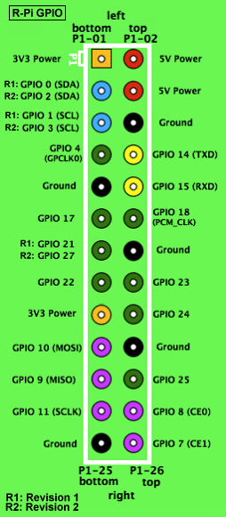

# Raspberry PI

Le manguie a [m4tu5](https://github.com/m4tu5) que cuando fuera a europa me la comprara.

## RaspBMC

Lo descargue del [sitio oficial](http://www.raspberrypi.org/downloads). 
Fue muy simple de instalar, solo hay que volcarlo a la microSD y al iniciar se realiza todo el resto, preferiblemente tiene que estar conectada a internet.
Funciona muy bien.

_**Nota:** Arora browser se instalo como parte de una actualización pero no funciona :(_

## Raspbian

Descargue la imagen y la deszipie luego lo bloque a la microSD. Salio andando.

## GPIO

Compile la herramientas para manejar en [bash los puertos GPIO](http://elinux.org/Rpi_Low-level_peripherals#Bash_shell_script.2C_using_sysafs.2C_part_of_the_raspbian_operating_system).
Como la experiencia fue muy simple solo tuve que usar ... pensé en ponerle una interfaz más amigable a algunos puestos del GPIO. 
Copiándome de la experiencia del [Gamepad universal](http://wiki.hackcoop.com.ar/Gamepad_universal) de [li-kun](https://github.com/li-kun) use fichas banana y un envase de plástico duro hecho cortado a mano.
Y los conectores de led de unas PCs viejas que sirvieron para conectar el GPIO a las fichas banana.

> 0, 1, 4, 7, 8, 9, 10, 11, 14, 15, 17, 18, 21, 22, 23, 24, 25 deberia usar solo estos puertos

### El control del GPIO desde la terminal

~~~
cd ~
git clone git://git.drogon.net/wiringPi
cd wiringPi
./build 
~~~

Aunque la salida de sonido no es análoga puede generar sonidos usando una modificación de `blink.c` para generar un pseudo-pwm.

## Pantalla

Lo conecte por RCA y anduvo directamente

### X11

Como no tengo espacio para otra pantalla en el escritorio mando el X11 del raspaberry a la pantalla de la computadora de escritorio.

~~~
sudo nano /etc/ssh/sshd_config
~~~
y agrego `X11Forwarding yes` para permitir enviar el X11 por la red.

Luego en la otra computadora: 

~~~
ssh -X pi@raspberry
~~~

y al correr cualquier aplicacion con X11 este aparecera en la otra pantalla, tambien se puede agregar en la configuracion de ssh para que esto ocurra por defecto al conectar por ssh en `.ssh/config`, ejemplo:

~~~
Host pi
User pi
Hostname raspberry
Port 22
ForwardX11 yes
~~~

Así uno solo necesita hacer `ssh pi` para conectar tanto por ssh como por X11.

### Android

Como tenia un android roto de mi hermana lo pensaba usar de pantalla y placa de red, usando este tutorial: http://blog.mohammedlakkadshaw.com/Android_as_display.html

Conecte el android al raspeberry y puse el android en metodo anclaje (tethering), luego instale `x11vnc` y `xvfb` en la raspberry y en el android `androidvnc`.
Mi idea es tener 2 pantallas una por red y otra fisica por HDMI/RCA

~~~
sudo ifconfig usb0 192.168.42.10
Xvfb :0 -screen 0 640x480x16 -shmem
x11vnc -display : 0
~~~

## VNC

~~~
sudo aptitude install tightvncserver
~~~

Ahora vamos a hacer que el servidor inicie cada vez que inicie

~~~
mkdir -p ~/.config/autostart/
~~~

y grabar lo siguiente en el archivo ~/.config/autostart/vnc.desktop

~~~
[Desktop Entry]
Type=Application
Name=TightVNC
Exec=vncserver :1 -geometry 1024x768 -depth 16
StartupNotify=false
~~~

~~~
sudo raspi-config
~~~

Y elegimos **3 Enable Boot to Desktop/Scratch** y luego **Desktop Log in as user 'pi' at the graphical desktop**, al reiniciar iniciara directamete el X11

## RaspISP

Este tutorial esta armado para Raspberry (el debian para raspberry)

Lo primero que hay que hacer es configurar el ISP de RaspberryPI con el comando `raspi-config`.
El ISP es un modo de comunicar dispositivos con otros, se usa principalmente para grabar datos en un microcontrolador.

~~~
cd  ~
sudo apt-get install bison automake autoconf flex git gcc gcc-avr binutils-avr avr-libc
git clone https://github.com/kcuzner/avrdude 
cd avrdude/avrdude
./bootstrap && ./configure && sudo make install
~~~

El control del gpio desde la terminal
~~~
cd ~
git clone git://git.drogon.net/wiringPi
cd wiringPi
./build 
~~~

### Conectar al ATtiny85

> Ahora tenemos que conectar nuestro ATtiny85 a la raspberryPI. Las resistencias son todas de 1000 Ohm.

Vamos a necesitar el control de GPIO que se explico anteriormente

~~~
sudo gpio -g mode 22 out
sudo gpio -g write 22 0
sudo avrdude -p t85 -P /dev/spidev0.0 -c linuxspi -b 10000
sudo gpio -g write 22 1
~~~

### Instalar el firmware

~~~
wget https://github.com/b4zz4/RaspberryPI/raw/master/micronucleus-1.06-upgrade.hex
~~~

Descargamos el firmware, es un programa que hace que el ATtiny85 se pueda acceder desde el USB y programarlo como un arduino.

~~~
sudo gpio -g mode 22 out
sudo gpio -g write 22 0
sudo avrdude -P /dev/spidev0.0 -c linuxspi -b 10000 -p t85 -U flash:w:micronucleus-1.06-upgrade.hex -U lfuse:w:0xe1:m -U hfuse:w:0x5d:m -U efuse:w:0xfe:m
sudo gpio -g write 22 1
~~~

Grabamos el firmware, en el microcontrolador.

* El Firmware orignal se puede bajar de https://github.com/micronucleus/micronucleus
* Este tutorial esta basado en http://www.paperduino.eu/doku.php?id=burning_bootloader

### Circuito para conectar por USB
 

> Este dibujo no es difinitivo

* Diodo 1N4148 
* 2 Diodos zener 3V6
* Resistencia 1k5 - 1500 Ohms 1/4W 
* 2 Resistencia 68 Ohm 1/4W
* Capacitor Ceramico 100nF 
* Capacitor Electrolitico 10uF/16V 

En mi experiencia de armar este circuito no logro comunicarse con la computadora.
Para que la computadora lo detecte necesitamos instalar las reglas de [Digispak](http://sourceforge.net/projects/digistump/files/) en [Arduino](http://arduino.cc/).

~~~
void setup() {               
  // inicia los pins
  pinMode(0, OUTPUT);	// LED1
  pinMode(1, OUTPUT);	// LED2
}
void loop() {
  // prende el LED1 y apaga el LED2
  digitalWrite(0, HIGH);
  digitalWrite(1, LOW);
  delay(1000);	//espera 1 segundo
  // apaga el LED1 y prende el LED2
  digitalWrite(0, LOW);
  digitalWrite(1, HIGH);
  delay(1000);	// espera 1 segundo
}
~~~

Este es uno de los ejemplos que vienen en la versión de arduino de Digispak

### Conectar Digispak por USB

No andubo al primer intento, no genero el dispositivo USB

probe instalando `modemmanager`

### Processing

Actualizamos el sistema e instalamos java 1.7

~~~
sudo apt-get update
sudo apt-get dist-upgrade
sudo apt-get install oracle-java7-jdk
sudo update-alternatives --config java # Elegimos la version 1.7 de java. 
wget http://download.processing.org/processing-2.2.1-linux32.tgz
tar xvzf processing-2.1-linux32.tgz
cd  ~/processing-*/
rm -rf java 
ln -s /usr/lib/jvm/jdk-7-oracle-armhf java
rm modes/java/libraries/serial/library/RXTXcomm.jar
cp /usr/share/java/RXTXcomm.jar modes/java/libraries/serial/library/
~~~

Ya podemos usar processing 

## X11

Como no tengo espacio para otra pantalla en el escritorio mando el X11 del raspaberry a la pantalla de la computadora de escritorio.

# RaspberryPI RepRap

## Printrun

~~~ 
sudo apt-get install -y python-pip git mercurial python-distribute wx-common  python-pmw python-imaging python python-tk idle python-psutil python-wxtools
sudo easy_install pip
sudo pip install pyserial
cd
git clone https://github.com/kliment/Printrun.git
wget http://fabmetheus.crsndoo.com/files/50_reprap_python_beanshell.zip
unzip 50_reprap_python_beanshell.zip
cd Printrun
python setup.py build
sudo python setup.py install
~~~

## Slic3r

~~~
sudo apt-get install -y git-core build-essential libgtk2.0-dev libwxgtk2.8-dev libwx-perl libmodule-build-perl libnet-dbus-perl cpanminus libextutils-cbuilder-perl gcc-4.7 g++-4.7 libwx-perl libperl-dev
sudo cpanm AAR/Boost-Geometry-Utils-0.06.tar.gz Math::Clipper Math::ConvexHull Math::ConvexHull::MonotoneChain Math::Geometry::Voronoi Math::PlanePath Moo IO::Scalar Class::XSAccessor Growl::GNTP XML::SAX::ExpatXS PAR::Packer
cd
git clone https://github.com/alexrj/Slic3r.git
cd Slic3r
git checkout 0.9.9
yes | sudo perl Build.PL
sudo ./Build install
~~~

## Compartir archivos

~~~
sudo apt-get -y install samba samba-common-bin
sudo mv /etc/samba/smb.conf /etc/samba/smb.conf.old
~~~

~~~
[global]
server string = Todomatic
security = share
lock directory = /var/cache/samba

[Archivitos]
comment = Compartidos
path = /home/pi/
writeable = yes
browsable = yes
read only = no
guest ok = yes
only guest = yes
force user = pi
create mask = 0666
directory mask = 0777

~~~

Compiar esto al archivo `/etc/samba/smb.conf`

~~~
sudo smbpasswd -a pi
~~~

Agrega una clave para samba

~~~
sudo service samba restart
~~~

Reinicar el servicio

## Servidor de impresora

~~~
sudo apt-get install cups
sudo usermod -a -G lpadmin pi
~~~

Modificar la configuración de permisos para usar cups en toda la red:

~~~
sudo nano /etc/cups/cupsd.conf
~~~

~~~
Listen *:631

...

</Location>
  Order allow,deny
  Allow 192.168.*.*
</Location>

# Restrict access to the admin pages...
<Location /admin>
  Order allow,deny
  Allow 192.168.*.*
</Location>

# Restrict access to configuration files...
<Location /admin/conf>
  AuthType Default
  Require user @SYSTEM
  Allow 192.168.*.*
  Order allow,deny
</Location>

~~~

~~~
sudo service cups restart
~~~

ahora podemos entrar a la url de cups en el http://raspberry.local:631

Basado en [este articulo](http://geekytheory.com/tutorial-raspberry-pi-12-como-crear-un-servidor-de-impresion/)

### Impresora por puerto paralelo via USB

## Pd-extend

~~~
wget https://puredata.info/downloads/pd-extended-0-43-3-on-raspberry-pi-raspbian-wheezy-armhf/releases/1.0/Pd-0.43.3-extended-20121004.deb
sudo dpkg -i Pd-0.43.3-extended-20121004.deb
sudo apt-get -f install 
~~~

## OctoPrint
=======

~~~
sudo pip install octoprint
~~~

https://github.com/kaosat-dev/CoffeeSCad

**Notas:** Falta poner los plugins

## Minihttp

Tenemos que modificar el archivo `/etc/mini-httpd.conf` con los siguiente datos:

~~~
host=0.0.0.0
port=80
user=nobody
chroot # yes
data_dir=/home/pi/www/
cgipat=cgi-bin/*
logfile=/dev/null
pidfile=/tmp/mini-httpd.pid
charset=utf-8
~~~

y reiniciar el servicio con `sudo service mini-httpd restart`

## Pendientes

* Pull-up en los puertos
* ~~Probarlo bien~~
 * algunos puertos no andan, por que son internos del raspberry(24,25)
 * Ejemplos de programación
* Compilar [Bluetooth de Guerrilla](https://github.com/b4zz4/BluetoothDeGuerrilla) para Raspberry
* Generar un escritorio con [remina](http://remmina.sourceforge.net/) para tener un escritorio de mas de 640x480 seguramente 6 veces mas grande :P

